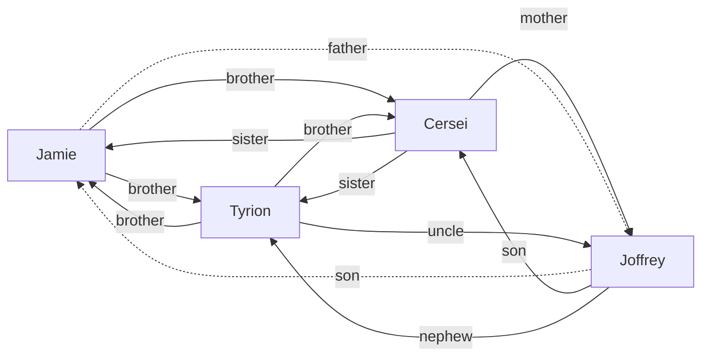
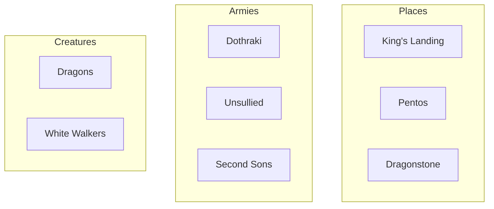
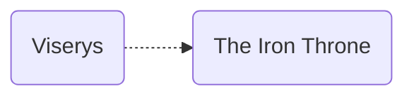
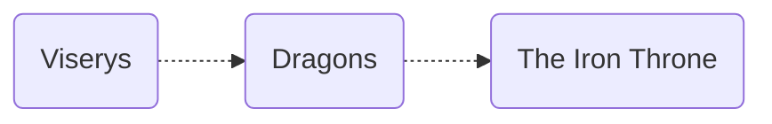
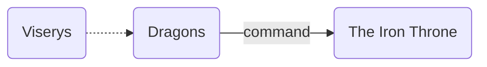
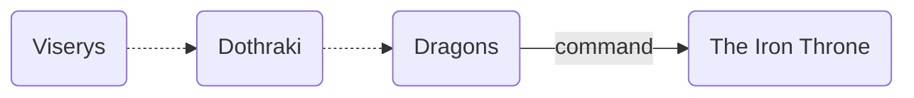
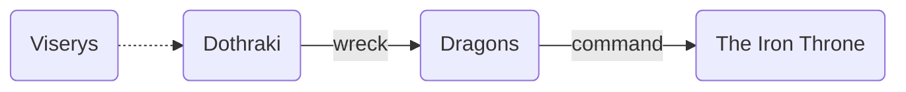
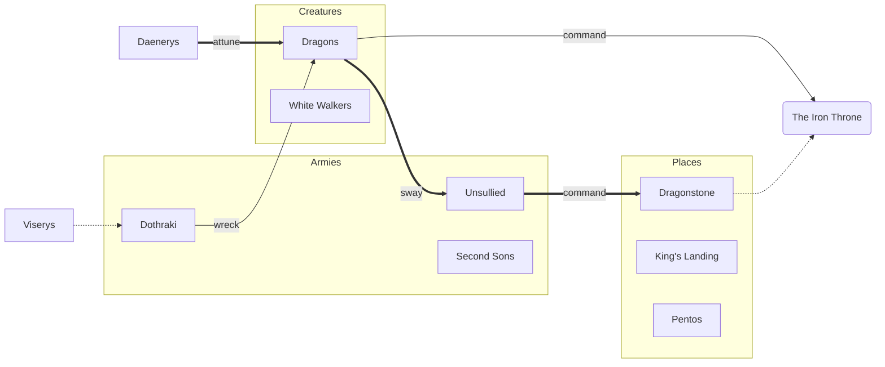

# Applications of graphs in story telling games

Welcome to part one in a series of articles on the exciting topic of using math to theoretically have fun.

## Motivation 
What's the difference between a role playing game and a pure story game or a pure tactical game? 

Relationships.

Building them and destroying them. 

A role-playing game is the endeavor of altering relationships to form a complex web which entangles your character in a story. To rip an entangled character from a story is to irrevocably tear a hole in the story and leaves the character without meaningful context.

In order to track this web of relationships, many game groups will explicitly graph them. Here is a "simple" example, 



This serves to document the game and helps create more interesting stories as the graph develops. But, why stop there? Relationships aren't just for people. Other relationship graphs can be created for factions, magic, ideas, locations or just about anything as long as its important to the story.  Moreover, these graphs can be connected to one another to create interconnected graphs of graphs.

This example shows how graphs can be used to describe an existing story. What if, we could instead create a tangled messy web of relationships first? what if we could then use this graph prescriptively to generate a story. We could trace arbitrary paths in our map to see hidden stories that would otherwise go unnoticed.

This gets me to my secret agenda. This game may have rules to be a story telling game but, its actually a graph building game. The game as presented is a veneer on top of the graph building game. It is structured in such a way that each decision can be trivially added to a graph. Eventually, I want to develop the techniques to convert this graph into readable stories. In this theoretical other version of the game we don't play scenes and there are no epilogues.

For a visual example how this works, see <a href="#how-to-create-a-complicated-messy-relationship-graph-in-one-easy-step-repeated"> this entry</a>

### Jargon
*[sub-graphs]: A graph contained in another graph.
*[sub-graph]: A graph contained in another graph.
*[graphs]: A structure that contains related objects. For our purpose the objects contained are vertices or sub-graphs. 
*[graph]: A structure that contains related objects. For our purpose the objects contained are vertices or sub-graphs.
*[vertices]:  (plural)  : An object contained in a graph
*[vertex]:  : An object contained in a graph
*[edges]: A relationship between two vertices
*[edge]: A relationship between two vertices
*[relationships]:  An edge between two vertices
*[relationship]:  An edge between two vertices
*[relation]:  An edge between two vertices

Domain specific, ambiguous or vague terms go here.

graph
: A structure that contains related objects. For our purpose the objects contained are vertices or sub-graphs.

sub-graph
: A graph contained in another graph.

vertex
 : An object contained in a graph

edge
 : A relationship between two vertices

relationship
 : A set of edges connecting two vertices. The order of a relationship is the minimum number of edges required to connect the vertices

journey
 : A player created graph. Represents an agent's path through the context

agent
 : An object in the shared imagination space which players may directly control. Also a vertex in the context.
 
context
: The state of the the shared imagination space. The graph which contains all other graphs.

layer
: A labeled sub-graph of the context. All vertices in a layer share the label as an implicit relationship.
 
Obstacle 
 : A vertex used to split a single unresolved edge into two unresolved edges.
 

## How to create a complicated messy relationship graph in one easy step (repeated)
*For each game a context is either supplied by a play-set or created by the players. This context is used in the following examples.*

*When an agent is first created,  It is assigned its own node. Additionally, a node is created for it's goal. These are connected by a dotted line representing the the link has yet to be resolved*

*During a players turn,  a complication is chosen. This splits the unresolved link into two links*


*Then, one of the unresolved links is resolved with an action. The link is now represented as a solid line and the action is noted. The relationship between Dragons and The Iron Throne is now fixed.*

*The following turn, another complication is is introduced. There is once again a single unresolved link which is once again split.*

*The player again chooses which of the links to resolve.*


>  *Following this procedure there will always be a single unresolved
> link for a story at the end of a players turn. The players choices 
> tell us that once Viserys can overcome the complication posed by the
> Dothraki that commanding the powers of The Iron Throne is inevitable.*

*For illustration purposes, I have transposed Viserys' story onto the context given above. His line is the narrower one. I also have transposed what his sister's path may look like as the bold line.*

## Having the talk. What do we call our relationship?

Lets look at some of our previous graphs again.

```mermaid
graph LR
subgraph House Lanister
Jamie -- brother --> Tyrion
Jamie -- brother --> Cersei
Tyrion -- brother --> Cersei
Tyrion -- brother --> Jamie
Cersei -- sister --> Jamie
Cersei -- sister --> Tyrion
Cersei -- mother --> Joffrey
Jamie -.->|father| Joffrey
Joffrey -.->|son| Jamie
Joffrey -- son --> Cersei
Joffrey -- nephew --> Tyrion
Tyrion -- uncle --> Joffrey
end
```



There are two separate relationship dichotomies at play. 

The first is intrinsic vs. extrinsic. Or, whether the relationship is an intrinsic property of the world or not. Jamie IS Tyrion's brother but, Daenerys CHOSE Dragons to attune herself to.

What are the consequences of this?
- An agent internal to the story has no power to change intrinsic relationships.
- An agent internal to the story may be able to change extrinsic relationships.

The second is inter-graph vs. intra-graph. Or, does the line cross one the blue borders. 

What are the consequences of this?
- All vertices contained in the same graph share an implicit relationship, namely the title of the graph.
- Vertices in different graphs have no implied relationship.

Great! what does this mean for me? For starters, remember when we had one type of relationship? Now we have four types. This means we can talk about relationships with more precision later on.

Types of Relationships
: intrisic inter-graph relationship
: intrinsic intra-graph relationship
: extrisic inter-graph relationship
: extrinsic intra-graph relationship

## Making levers
>Give me a lever long enough and a fulcrum on which to place it, and I shall move the world. - Archimedes  

But what if we don't want to move the world? We spent a lot of time getting the world exactly where it is. What if we just want to nudge our character past those guards without anyone asking questions?

>Give me an appropriately long lever and rules on when I can use it, and I shall move the narrative along. - Me, now

Let's make some appropriately long levers. 

Instead of using levers, I'm going to steal some jargon from the programming world and call them an interface. These represent the things we can do as players to indirectly alter the world. We need to understand what the interface expects from us as input. Though, what an interface actually does behind the scenes can remain unknown.

> If you haven't read <a href="#how-to-create-a-complicated-messy-relationship-graph-in-one-easy-step-repeated"> this entry</a>, now would be a good time for that. This is a visual explanation of the main game mechanic that we will be working on the interface for.

The basic idea here is as follows
~~1. We are on a journey.
2. Some parts of the journey are known~~
3. One part of the journey is unknown
4. We are presented with an obstacle that occurs sometime during the unknown portion of our journey
5. We are given a decision to make
6. We look at our choices
7. We make a choice
8. We continue our updated journey

Prepare for code. I will walk you through it. I assure you that this completely untested coded has a chance of being runnable.

```Java
// for all these examples you can ignore the "extends blah blah blah" part. its just more abstraction

// rules for our journey. 
interface Journey extends Function<Obstacle, Decision> {
	// we can present our journey with an obstacle and we we get back a descision to make
	// @see step 5
	Decision apply(Obstacle obstacle)
	// we can get the unknown region
	// @see step 3
	Unknown getUnknown()
}
```
```Java
// rules for the world
interface World extends Function<Journey, Obstacle> {
	// we can get an approriate obstacle based on our current journey's unknown region
	// @see step 4
	Obstacle apply(Journey journey)
}
```
```Java
// rules for decisions
interface Decision extends Function<Choice, Journey> {
	// we can make our choice and then we get a new updated journey
	// @see step 8
	Journey apply(Choice choice)
}
```
```Java
// rules for choices
interface Choice extends Supplier<Obstacle>, Consumer<Obstacle> {
	// we can look at which obstacles we can choose from
	// @see step 6
	Obstacle get()	
	// we can lockin one of the obstacles as our choice
	// @see step 7
	void accept(Obstacle obstacle)
}
```
```Java
// rules for options
interface Obstacle extends Consumer<Action>{
	// we can resolve an obstacle by using an action
	// @see step 7
	void accept(Action action)
}
```

Maybe this seems a bit excessive. How hard is choosing one of two options? It seems like a single step but there at least 8 unique steps in the code here. Some may be repeated or skipped but laying them out like this is testable and will let us really analyse our design later on.

## My safe word is "extrinsic intra-graph relationship" or, how to set boundaries
Who has authority over what?

Let's be explicit about who who is. For our purposes I have identified three stakeholders. The designer, who makes the graphs initially (could happen to be the players). The Players, who play the game and manipulate relationships. The world, which responds to changes made by the players.

Now what's what? The major domain concepts we are working with are graphs, vertices and relationships. 

> If you haven't read about the different type of relationships, now is a good time to read <a href="#having-the-talk.-what-do-we-call-our-relationship">this entry</a>.

I have decided that once a game starts, graphs and vertices don't change. This means the only stakeholder with authority over these is the designer. However, all stakeholders have at least some authority over relationships.

|          | graphs | vertices | relationships |
|----------|:------:|:--------:|:-------------:|
| players  |        |          | Y*             |
| world    |        |          | Y*             |
| designer | Y      | Y        | Y             |

*\*detailed relationship guidelines*

|         | extrinsic intra-graph | extrinsic inter-graph | intrinsic intra-graph | intrinsic inter-graph |
|---------|:---------------------:|:---------------------:|:---------------------:|:--------------------:|
| players | Y                     | N                     | N                     | N
| world   | N                     | Y                     | N                     | N

Once the game starts, players are only able to interact with relationships through their characters. As discussed in a previous article, agents which are a part of the world are unable to alter intrinsic relationships. This means players and the world are unable to alter them.

This leaves us with two stakeholders with no authority and also two types of relationships. I think that the most interesting way to assign authority is to give players intra-graph responsibility and give inter-graph responsibility to the world. This lets players make big dynamic changes to the story in a more focused way. This still lets the world make changes but in a less dynamic way.

> note to self: what happens when a baby is born?

## determining appropriate appropriate obstacles

In a previous section, we used this graph.


We inserted the  'Dothraki' vertex resulting in this intermediate graph.


But, how do we know 'Dothraki' is an appropriate vertex to choose? What choices are reasonable and what choices are interesting?

Let's begin with the question of what's reasonable. A reasonable choice should have the following characteristsics: 
* share a relationship with each vertex of the unresolved link
* not a dead end or cyclical

Given these as a starting point we can use the following characteristics to make sure it is interesting:
* doesn't share a layer with either vertex in the unresolved link
* lower order relationships are better

So, was 'Dothraki' an appropriate choice? With the given context, no. However, that context is extremely minimal. It would be easy imagine a more filled out context with all of these vertices sharing 'Daenerys' as a common relationship.


